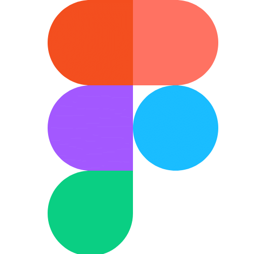

# 👋 Olá, eu sou Maria Eduarda Ramos Ribeiro

## ☕ Desenvolvedora Java em Formação | Construindo o futuro com código limpo e eficiente

> 💼 **Atualmente:** Estagiária na Baker Hughes | Buscando oportunidades em Desenvolvimento Java  
> 🎯 **Foco:** Java, Spring Framework, APIs REST e desenvolvimento backend  
> 📍 **Localização:** Niterói - Rio de Janeiro

---

## 🛠️ Stack Tecnológica

### ☕ Backend & Core

### 🌐 Frontend & Web

### 🗄️ Banco de Dados

### 📊 Data Science & Analytics

### 🛠️ Ferramentas & DevOps

### 🚀 Aprendendo Atualmente

---

## 📈 Estatísticas GitHub

  
  

---

## 🎯 Projetos em Destaque

### 🎵 Music Catalog - Sistema de Gerenciamento Musical
**Descrição:** Aplicação desktop completa para gerenciar artistas, músicas e playlists com interface gráfica Swing e persistência de dados  
**Tecnologias:** Java 21, Swing, MySQL, JDBC, Eclipse  
**Destaques:** 
- ✅ CRUD completo para artistas, músicas e playlists
- ✅ Interface interativa com JTable e edição por duplo clique
- ✅ Padrão Singleton para conexão com banco de dados
- ✅ Validação de entrada e diálogos de confirmação
- ✅ Arquitetura MVC implícita com código modular
- ✅ Tratamento robusto de exceções SQL

🔗 **[Código no GitHub](https://github.com/mariaeramos18/MusicCatalog)**

---

### 📦 Gerenciador de Estoque - Sistema Web de Controle
**Descrição:** Sistema web para controle e gerenciamento de estoque com interface responsiva e funcionalidades de cadastro  
**Tecnologias:** JavaScript, HTML5, CSS3, Bootstrap  
**Destaques:**
- ✅ Interface responsiva e intuitiva
- ✅ Funcionalidades de cadastro e controle de produtos
- ✅ Manipulação dinâmica do DOM com JavaScript
- ✅ Design moderno com Bootstrap
- ✅ Validações client-side para melhor UX

🔗 **[Código no GitHub](https://github.com/mariaeramos18/proj-tecweb)**

---

### 🚀 Em Desenvolvimento
**🔄 Próximos Projetos:** API REST com Spring Boot, sistema com AWS e programação reativa

---

## 💼 Experiência Profissional

**🏢 Baker Hughes | Estagiária em Análise de Dados** *(Dezembro/2024 - Presente)*
- 🚀 **Automatização de Processos:** Implementei scripts Python e VBA que reduziram tarefas manuais em **83%**, gerando documentação técnica automatizada
- 📊 **Business Intelligence:** Desenvolvimento de dashboards interativos em Power BI e Tableau para KPIs técnicos e suporte à tomada de decisão estratégica
- 💻 **Sistema Full-Stack:** Criei aplicação Python/Flask para análise de desenhos de engenharia, reduzindo tempo de revisão em **80%** com versionamento Git
- 📈 **Otimização de Produção:** Automatizei processos Excel com VBA, alcançando **75% de redução** no tempo de produção de relatórios
- 🌐 **Comunicação Internacional:** Apresentações técnicas em inglês avançado para stakeholders sobre melhorias baseadas em metodologia Lean
- 🔧 **Suporte Técnico:** Gestão de ciclo de vida de produtos (PLM) e suporte a áreas operacionais com soluções baseadas em Oracle SQL

**📊 Tecnologias Utilizadas:** Python, VBA, Oracle SQL, Power BI, Tableau, Flask, Git, Metodologia Lean

---

## 🎓 Formação & Certificações

**🎓 Análise e Desenvolvimento de Sistemas** - Faculdade Senac RJ *(2024 - 2026)*  
*Cursando 2º período | Previsão de formatura: Dezembro/2026*

**📊 Curso de Análise de Dados - Big Data** - Senac RJ *(Concluído)*
- Python para Análise de Dados (NumPy, Pandas)
- Visualização de Dados (Matplotlib, Seaborn) 
- Machine Learning (Scikit-Learn)
- Aplicação prática em projetos de Big Data

---

## 🤝 Vamos Conectar?

  
  
  

---

  

